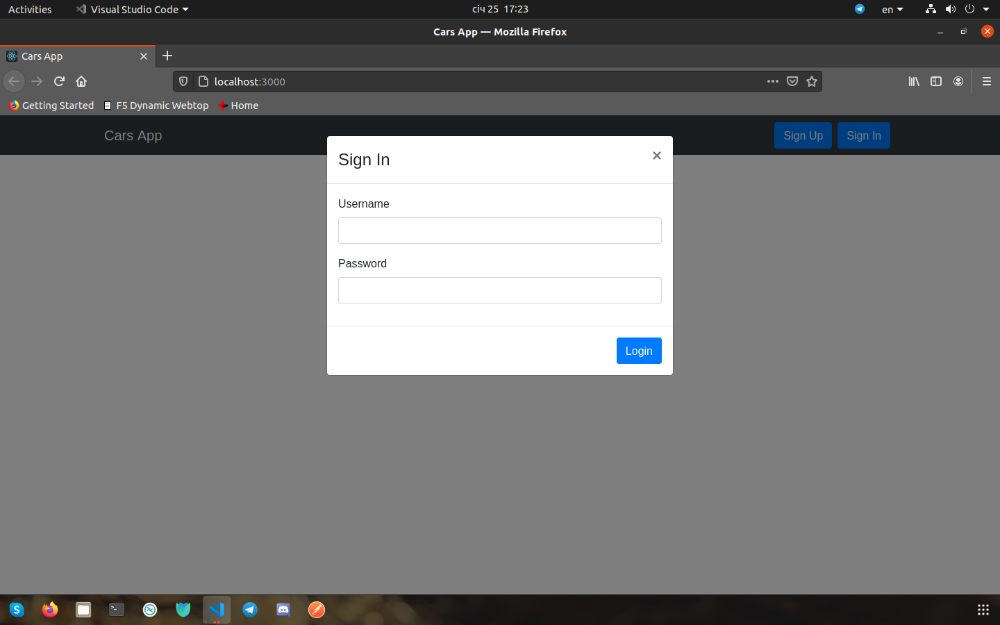

# Cars App

A simple example of how to consume a `RESTful API` in `React` 

## Dependencies:

- `Node.js` (`npm` and `npx`);
- `Docker`;
- `PostgreSQL`;
- `Go`

### **Libs**: 
- `gorilla/mux`;
- `jackc/pgx`;
- `jackc/tern`;
- `joho/godotenv`;
- `rs/cors`;
- `dgrijalva/jwt-go`;

## How to start:

1. Clone my project:  
    
    ```properties
    git clone ...
    ```
2. Start make's command:  
    1. Start DB `PostgreSQL` and open bash:

        ```properties
        vzhuchkov@linux:~/go/src/Backend-Go-Frontend-React$ make run-db 
        docker run --name postgres -p 5432:5432 -e POSTGRES_PASSWORD=postgres -d postgres:alpine
        8dcb4c1d2b24a8a47434b740cb627aeffb323fbc53264157f7c6a6fb7df4ef6b
        docker exec -it postgres bash
        bash-5.0# 
        ```
        ***Note:** use command `psql -U postgres` to login.*
    2. Start RESTful API:
        
        ```properties
        vzhuchkov@linux:~/go/src/Backend-Go-Frontend-React$ make run
        go run go-server/cmd/main.go
        2021/01/14 16:47:21 Connected to Postgres database!
        2021/01/14 16:47:21 Migrate success!
        2021/01/14 16:47:21 Current version of the database:  1
        Starting server on port 8000...
        ```
    3. Open link:

        ```properties
        vzhuchkov@linux:~/go/src/Backend-Go-Frontend-React$ cd react-client
        vzhuchkov@linux:~/go/src/Backend-Go-Frontend-React/react-client$ make run
        ```
## Screenshots:

### **Before Sign In:**

**Home**:


**Sign Up**:


**Sign In**:



### **After Sign Up:**

**Home**:


**Create**:


**Edit**: 


**Delete**:


### **Other:**


